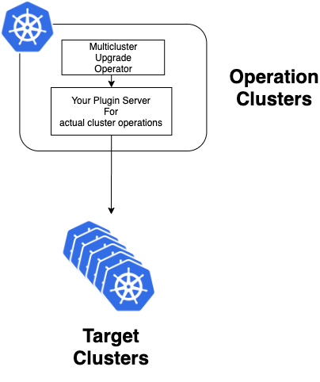
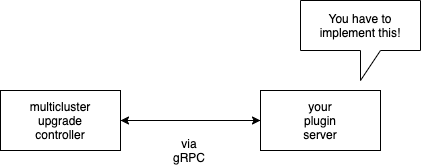
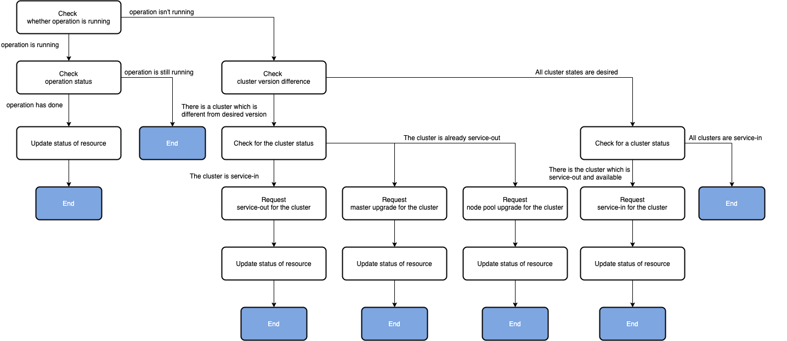

# multicluster-upgrade-operator

Custom Kubernetes Controller for managing multi-cluster upgrading.

This controller supports you to automate rolling upgrade clusters.

This allows you to safely upgrade the cluster version and core workloads (e.g. istio).

This operator supports operations of upgrading that cannot be handled by surge upgrades, etc.

## Overview

This controller should run in a different cluster from operation target clusters.

This controller is a plugin architecture.

The operations of the cluster depend on each cloud provider and so on.

Therefore, you have to implement plugin-server according to a proto file, this controller would
communication with it via gRPC.





## Features

- Rolling upgrade versions of clusters
- Rolling upgrade core workloads (TBD)

## How to use

### Prerequired

- [cert-manager](https://cert-manager.io/docs/installation/kubernetes/)
    - use for webhook server

### Install

```bash
//TODO: Insert later
```

### ClusterVersion Resource

```yaml
apiVersion: multicluster-ops.io/v1
kind: ClusterVersion
metadata:
  name: multicluster-sample
  namespace: multicluster-system
spec:
  requiredAvailableCount: 1
  opsEndpoint:
    endpoint: "your-plugin-server.multicluster-system.svc.cluster.local:39000"
    insecure: true
  clusters:
    - id: projects/your-project-id/locations/your-cluster-region/clusters/your-cluster-name-1
      version: 1.16.15-gke.4301
    - id: projects/your-project-id/locations/your-cluster-region/clusters/your-cluster-name-2
      version: 1.16.15-gke.4300
```

| name | type | required | description |
| --- | --- | --- | --- |
| `.spec.requiredAvailableCount` | `integer` | required | The number controller must keep to ensure availability. If available clusters would be less than this value by servicing out, the controller will not perform the operation. |
| `.spec.opsEndpoint` | `Object` | required | opsEndpoint is the server's endpoint to actually perform operations. This is implemented as a plugin and gRPC server. |
| `.spec.opsEndpoint.endpoint` | `string` | required | gRPC server's endpoint. |
| `.spec.opsEndpoint.insecure` | `bool` | optional | If this value is `true`, controller communicate with the gRPC server without TLS. default value is `false`. |
| `.spec.clusters` | `Object` | required | The value is actual definition of clusters. This must have more than two cluster definitions. |
| `.spec.clusters.*.id` | `string` | required | This is the cluster id which is defined in your using cloud provider. |
| `.spec.clusters.*.version` | `string` | required | The desired version of the cluster. |

### Custom Metrics

This controller exports prometheus metrics.

| name | type | description |
| --- | --- | --- |
| `multicluster_controller_success_operation_total` | `counter` | The number of performed cluster operations as success. |
| `multicluster_controller_failed_operation_total` | `counter` | The number of performed cluster operations as failure. |
| `multicluster_controller_success_plugin_call_total` | `counter` | The number of call as success for plugin server. |
| `multicluster_controller_failed_plugin_call_total` | `counter` | The number of call as failure for plugin server. |

### Controller Options

| name | type | description |
| --- | --- | --- |
| `--sync-period-seconds` | `integer` | The seconds of sync interval. |
| `--metrics-addr` | `string` | The address of the metric server. (default ":8080") |
| `--enable-leader-election` | `bool` | The flag represents whether enable leader election for controller manager. Enabling this will ensure there is only one active controller manager. |
| `--debug` | `bool` | The flag represents whether debug log should export. |

### Implement your plugin server

You have to implement the gRPC server as the proto file
in [multicluster-upgrade-operator-proto](https://github.com/taisho6339/multicluster-upgrade-operator-proto)
.

## How to install

```sh
kubectl apply -f https://raw.githubusercontent.com/taisho6339/multicluster-upgrade-operator/v0.0.1/manifests/install.yaml
```

## How does it work?

This controller rolled-upgrades each cluster in 5 steps as below.

1. Check differences between versions of your clusters and desired versions defined in '
   multicluster' resource.
2. Remove one of the clusters from the routing (service out)
3. Upgrade master of the cluster to the desired version
4. Upgrade node pool(or node group in AWS) to the desired version
5. Add the cluster to the routing if the cluster is available (service in)

### In Reconcile loop

This diagram is a flow chart in the reconcile loop.


